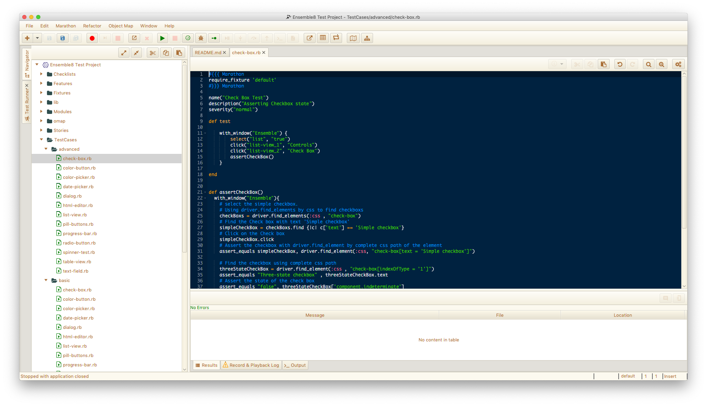

# Marathon Fx Demo

## Description
[Marathon](https://github.com/jalian-systems/marathonv5) is an opensource tool to automate tests for Java Swing&trade; and Java/Fx&trade; applications. This project is a demo project to show capabilities of Marathon test scripts. This demo project can also be used with [MarathonITE](https://marathontesting.com).

**Marathon Fx Demo** contains list of testcases for each Fx node. The basic scripts are what Marathon generates by using inbuilt recorder. The advanced folder contains scripts that more or less perform the same functions but using Marathon JavaDriver's [Selenium/WebDriver](https://seleniumhq.org) bindings. The test cases are in Ruby language.

## How to use?
1. Download zip file or clone the project into a folder.
2. If not already installed, Download **Marathon** from [SourceForge Website](https://sourceforge.net/projects/marathonman) and extract the zip into a folder. Marathon requires Java 1.8 to run.
    Or  alternatively Download [MarathonITE](https://marathontesting.com) and install the software.
4. Run the application using **marathon.bat** file for **Windows** and **marathon.sh** for **Linux/mac OS** from terminal.
5. From the **Marathon Project Selection Window** browse for the marathon-fx-demo project.

## Test Cases
The following are the test cases in this project.

Component | Test Case Name  | Notes 
--- | --- | ---
*check-box* | `basic/check-box.rb` `advanced/check-box.rb` | 
*color-button* | `basic/color-button.rb` `advanced/color-button.rb` |
*color-picker* | `basic/color-picker.rb` `advanced/color-picker.rb` |
*date-picker* | `basic/date-picker.rb` `advanced/date-picker.rb` |
*dialog* | `basic/dialog.rb` `advanced/dialog.rb` |
*html-editor* | `basic/html-editor.rb` `advanced/html-editor.rb` |
*list-view* | `basic/list-view.rb` `advanced/list-view.rb` |
*pill-button* | `basic/pill-button.rb` `advanced/pill-button.rb` |
*progree-bar* | `basic/progress-bar.rb` `advanced/progress-bar.rb` |
*radio-button* | `basic/radio-button.rb` `advanced/radio-button.rb` |
*spinner-test* | `basic/spinner-test.rb` `advanced/spinner-test.rb` |
*table-view* | `basic/table-view.rb` `advanced/table-view.rb` |
*text-field* | `basic/text-field.rb` `advanced/text-field.rb` |
